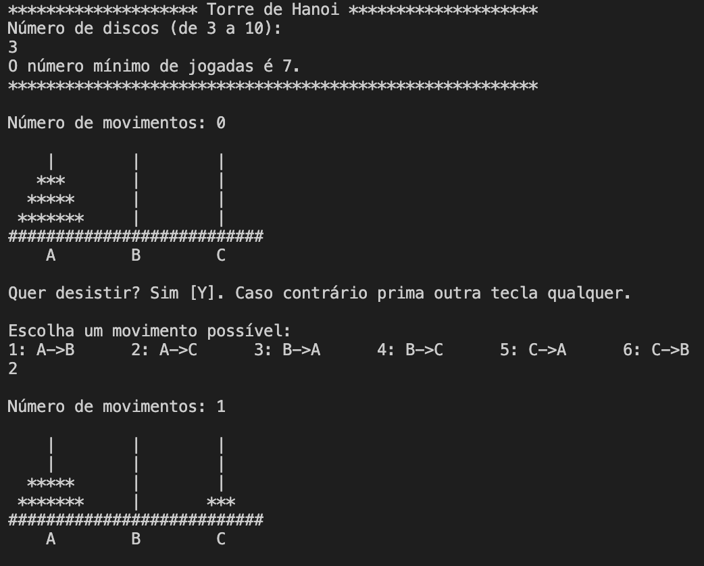

# Tower of Hanoi

Tower of Hanoi is a mathematical puzzle where we have three rods and n disks. The objective of the puzzle is to move the entire stack to another rod, obeying the following simple rules:
- Only one disk can be moved at a time.
- Each move consists of taking the upper disk from one of the stacks and placing it on top of another stack i.e. a disk can only be moved if it is the uppermost disk on a stack.
- No disk may be placed on top of a smaller disk.

This project is a simple implementation of this game that has been created by me in the "Computer Systems" class.
In a Java environment, run the script Projeto1.java. The script can easily be adapted to play the game with a different number of disks N, for example.

## Example (in portuguese)

